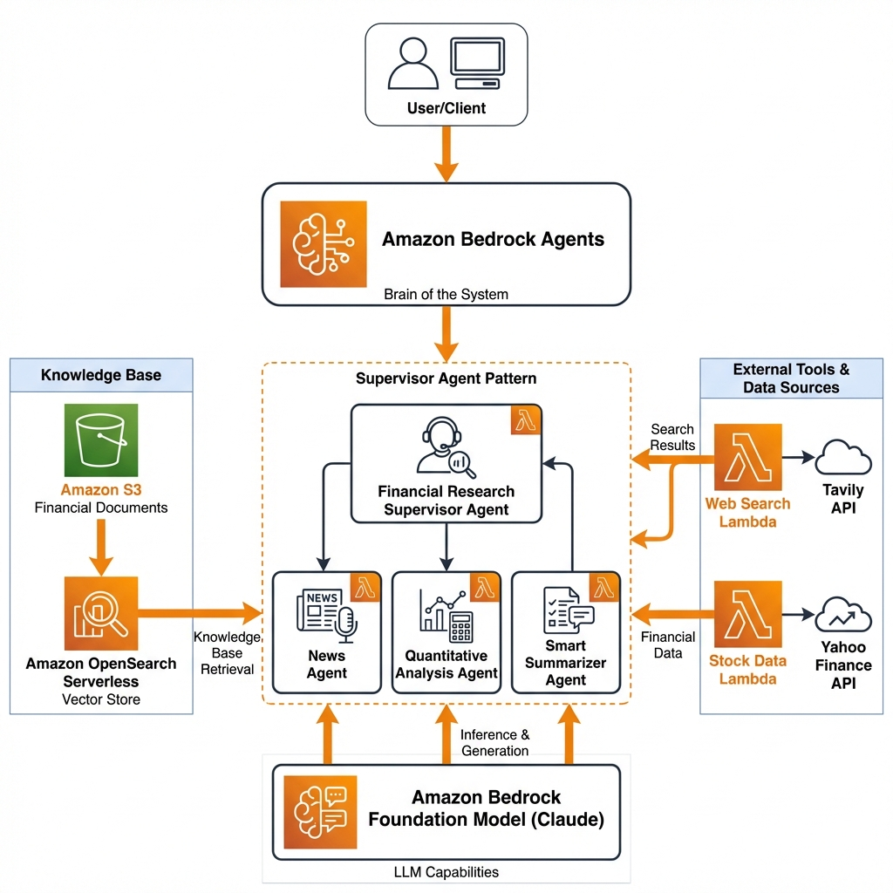

# Financial Research Assistant Agent

A multi-agent collaboration system built on **Amazon Bedrock** that performs comprehensive financial research and investment analysis. The system uses a supervisor agent pattern to orchestrate specialized sub-agents for news research, quantitative analysis, and intelligent summarization.

> [!NOTE]
> **Results from these agents should not be taken as financial advice.**

## Architecture



## Features

- **Multi-Agent Orchestration**: Supervisor pattern coordinates specialized agents
- **Knowledge Base Integration**: Analyze SEC filings, earnings calls, and financial reports
- **Real-Time Data**: Fetch live stock prices and market news
- **Portfolio Optimization**: Mean-variance optimization for investment portfolios
- **Guardrails**: Content filtering to prevent discussion of restricted topics
- **Extensible**: Easy to add new agents or tools

## Prerequisites

### 1. Clone and Setup Environment

```bash
git clone https://github.com/yourusername/financial-research-agent.git

cd financial-research-agent

# Create and activate virtual environment
python3 -m venv .venv
source .venv/bin/activate

# Install dependencies
pip3 install -r requirements.txt
```

### 2. AWS Configuration

Ensure you have AWS credentials configured with appropriate permissions:

```bash
aws configure
```

### 3. Deploy Lambda Tools

**Web Search Tool** (requires [Tavily API](https://docs.tavily.com/docs/gpt-researcher/getting-started) key):

```bash
cd src/shared/web_search
sam build && sam deploy --guided
```

**Stock Data Tool**:

```bash
cd src/shared/stock_data
sam build && sam deploy --guided
```

### 4. Enable Foundation Models

Enable the following models in Amazon Bedrock:
- Claude 3.5 Sonnet (us.anthropic.claude-3-5-sonnet-20241022-v2:0)
- Amazon Titan Embeddings (amazon.titan-embed-text-v2:0)

## Usage

### Running the Notebook

Navigate to the examples directory and run the Jupyter notebook:

```bash
cd examples/multi_agent_collaboration/financial_research_agent
jupyter notebook main.ipynb
```

### Example Queries

```python
# Analyze recent stock performance with news correlation
request = "What's AAPL stock price doing over the last week and relate that to recent news"
result = financial_research_assistant.invoke(request)

# Portfolio optimization (requires at least 3 tickers)
request = "Optimize my portfolio with AAPL, MSFT, and GOOGL"
result = financial_research_assistant.invoke(request)

# Analyze financial reports
request = "Analyze Amazon's financial health based on the 2024 10K report"
result = financial_research_assistant.invoke(request)
```

## IAM Policy

> [!IMPORTANT]
> This IAM policy is highly permissive and grants access to multiple AWS services including IAM, S3, Lambda, and Bedrock. It should only be used for prototyping in isolated, non-production environments.

```json
{
    "Version": "2012-10-17",
    "Statement": [
        {
            "Sid": "AllowBedrockAccess",
            "Effect": "Allow",
            "Action": ["bedrock:*"],
            "Resource": "*"
        },
        {
            "Sid": "AllowS3Access",
            "Effect": "Allow",
            "Action": [
                "s3:GetObject",
                "s3:PutObject",
                "s3:ListBucket",
                "s3:CreateBucket"
            ],
            "Resource": [
                "arn:aws:s3:::financial-research-data*",
                "arn:aws:s3:::bda-processing*/*"
            ]
        },
        {
            "Sid": "AllowOpenSearchServerless",
            "Effect": "Allow",
            "Action": ["aoss:*"],
            "Resource": "*"
        },
        {
            "Sid": "AllowIAMRoles",
            "Effect": "Allow",
            "Action": [
                "iam:GetRole",
                "iam:ListRoles",
                "iam:PassRole"
            ],
            "Resource": ["arn:aws:iam::*:role/*AmazonBedrock*"]
        },
        {
            "Sid": "AllowLambdaInvoke",
            "Effect": "Allow",
            "Action": [
                "lambda:InvokeFunction",
                "lambda:GetFunction",
                "lambda:ListFunctions"
            ],
            "Resource": "arn:aws:lambda:*:*:function:*"
        }
    ]
}
```

## Project Structure

```
financial-research-agent/
├── README.md                 # This file
├── LICENSE                   # Apache 2.0 License
├── requirements.txt          # Python dependencies
├── src/
│   ├── utils/
│   │   ├── bedrock_agent.py       # Agent helper classes
│   │   └── knowledge_base_helper.py  # KB utilities
│   └── shared/
│       ├── web_search/            # Tavily web search Lambda
│       └── stock_data/            # Stock data Lambda
└── examples/
    └── multi_agent_collaboration/
        └── financial_research_agent/
            ├── README.md
            └── main.ipynb         # Main demonstration notebook
```

## Contributing

Contributions are welcome! Please read our contributing guidelines and submit pull requests to the main branch.

## License

This project is licensed under the Apache-2.0 License. See the [LICENSE](LICENSE) file for details.

## Acknowledgments

This project is inspired by the [Amazon Bedrock Agent Samples](https://github.com/awslabs/amazon-bedrock-agent-samples) from AWS Labs.
